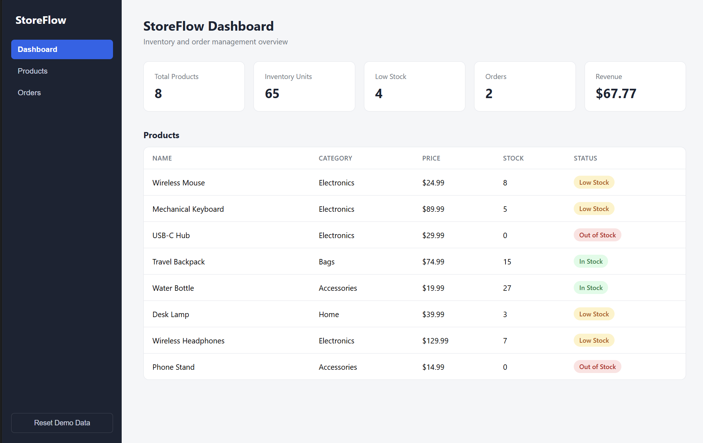
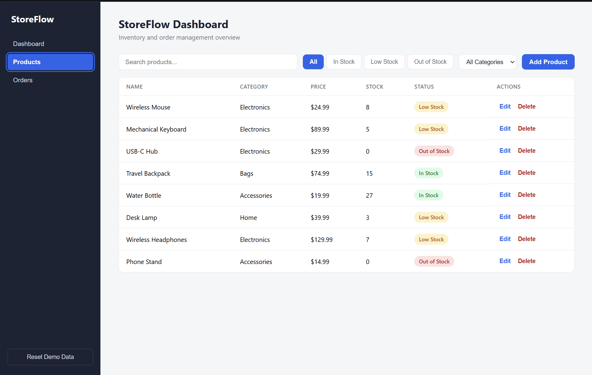
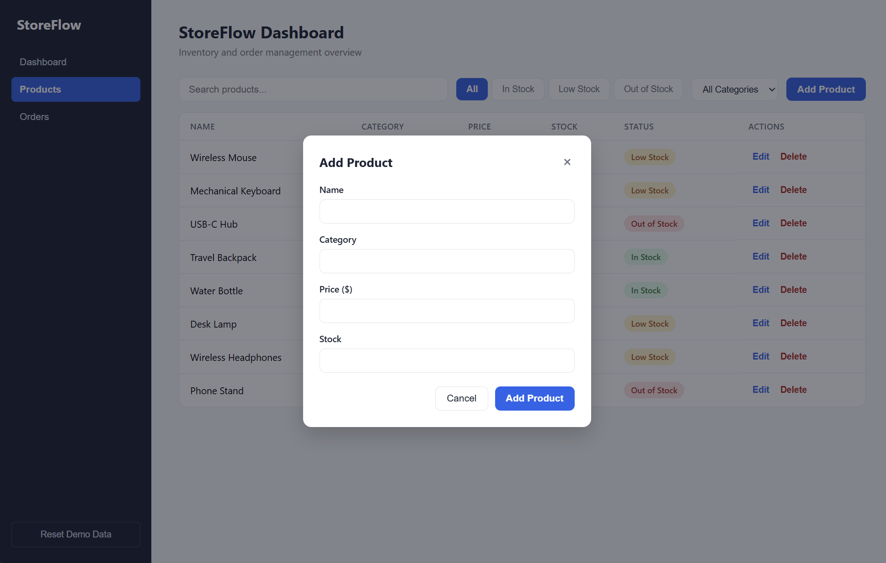
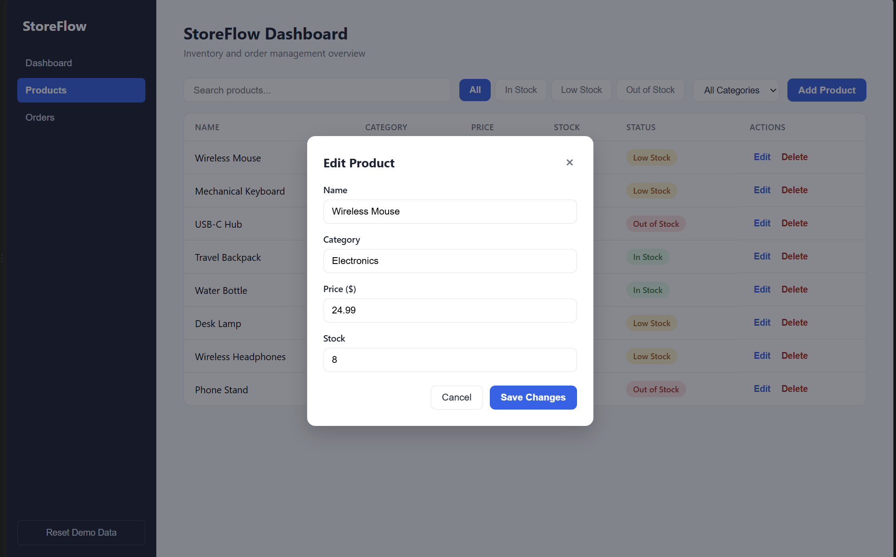
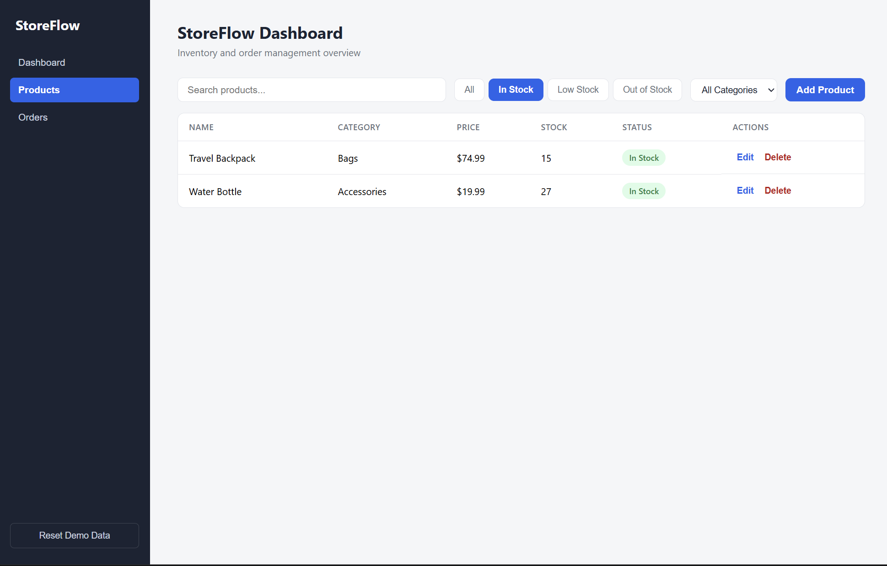
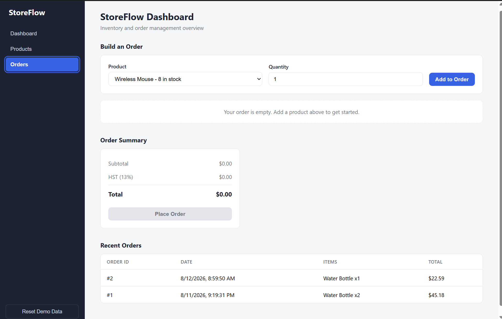

# StoreFlow

**Inventory & Order Management Dashboard for Merchants**

StoreFlow is a merchant-facing web application for managing product catalogs, tracking inventory levels, building and placing customer orders, and monitoring revenue in real time. It's built as an original commerce dashboard, not a clone of any existing platform's UI, with a focus on correct business logic, clean component design, and a professional, uncluttered interface.

## Overview

Small merchants need a fast way to see what they're selling, what's running low, and what orders have come in, without wading through a heavyweight platform. StoreFlow is a lightweight, single-page dashboard that covers the core loop of running a store: manage products, take orders, watch inventory drop in real time, and see revenue update immediately.

## Problem

Merchants managing inventory manually (spreadsheets, notebooks, memory) run into the same recurring issues:

- No single view of what's in stock, what's low, and what's sold out
- No safeguard preventing an order from being placed for more units than actually exist
- No easy way to see how a sale affects stock and revenue at the same time
- Tax calculations done by hand, invite arithmetic errors

## Solution

StoreFlow centralizes products, inventory, and orders into one dashboard. Placing an order automatically validates against live stock, calculates subtotal/tax/total, deducts the purchased quantity from inventory, and updates revenue, all instantly, all in the browser.

## Features

- **Dashboard**: five live stat cards showing Total Products, Inventory Units, Low Stock count, Orders placed, and Revenue, all derived from current app state
- **Product management**: add, edit, and delete products with full field validation
- **Search & filters**: live search by name or category, plus status filters (All / In Stock / Low Stock / Out of Stock) and an optional category filter
- **Automatic inventory status**: every product is classified as In Stock, Low Stock, or Out of Stock based on its quantity
- **Order builder**: select a product and quantity, add it to a running cart, and review before placing
- **Order validation**: a customer can never order more units than are currently in stock; the app blocks the attempt and explains exactly how many units are available
- **Tax-aware order calculations**: subtotal, Ontario HST (13%), and total are computed with reusable, testable functions
- **Inventory auto-deduction**: placing an order immediately subtracts purchased quantities from stock and reflects the new status everywhere
- **Order history**: the five most recent orders are shown with date, items, and total
- **Persistent state**: products and orders are saved to `localStorage`, so the app survives a page refresh; corrupted or missing storage falls back safely to starter data
- **Reset Demo Data**: a one-click, confirmation-gated reset back to the original starter catalog, useful for repeated demos

## Technologies

- React 19 (function components, hooks)
- Vite
- JavaScript (ES2022+)
- Plain CSS (custom properties, flexbox, CSS grid)
- Browser `localStorage`
- Git / GitHub

No backend, database, authentication, or external APIs. All state lives in the browser by design, keeping the project focused and easy to reason about end to end.

## Architecture

```
src/
  components/
    Sidebar.jsx          navigation between Dashboard / Products / Orders
    DashboardStats.jsx   derives and renders the five stat cards
    ProductTable.jsx     renders a product list with optional edit/delete actions
    ProductForm.jsx      add/edit form with inline validation
    SearchBar.jsx        controlled search input
    InventoryBadge.jsx   renders a status pill (In Stock / Low Stock / Out of Stock)
    Modal.jsx            reusable dialog (Escape to close, click-outside to close)
    OrderBuilder.jsx      product/quantity picker + running cart
    OrderSummary.jsx      subtotal / tax / total + Place Order action
    OrderHistory.jsx      most recent orders
  utils/
    inventory.js          getInventoryStatus(), filterProducts()
    calculations.js        calculateSubtotal(), calculateTax(), calculateTotal(), formatCurrency()
    validation.js          validateProduct(), validateOrderQuantity()
    storage.js              load/save products & orders to localStorage, with fallback
  data/
    starterProducts.js    seed catalog used on first load and on reset
  App.jsx                 owns all application state, wires components together
  App.css                  all component styling
```

State lives in `App.jsx` and flows down to components as props; components report user actions back up through callback props (`onEdit`, `onDelete`, `onAddToCart`, etc.). Business logic (validation, tax math, inventory status, filtering) is factored out of components entirely and lives in `utils/`, so it's reusable and easy to test in isolation from the UI.

## Running Locally

```bash
git clone https://github.com/<your-username>/storeflow.git
cd storeflow
npm install
npm run dev
```

Then open `http://localhost:5173/` in your browser.

## Key Business Logic

**Inventory status** is derived, not stored: a product's status is always computed from its current stock count, so it can never drift out of sync:

```js
function getInventoryStatus(stock) {
  if (stock === 0) return "Out of Stock";
  if (stock <= 10) return "Low Stock";
  return "In Stock";
}
```

**Order validation** is centralized in one reusable function, called both when adding an item to the cart and again defensively at checkout (in case stock changed in the meantime):

```js
function validateOrderQuantity(product, requestedQuantity) {
  if (!Number.isFinite(requestedQuantity) || requestedQuantity <= 0) {
    return "Quantity must be at least 1.";
  }
  if (requestedQuantity > product.stock) {
    return `Only ${product.stock} units are available.`;
  }
  return null;
}
```

**Order totals** use Ontario HST (13%) via small, composable functions rather than one large inline calculation:

```js
calculateSubtotal(cartItems) → sum of price × quantity
calculateTax(subtotal)       → subtotal × 0.13
calculateTotal(subtotal, tax) → subtotal + tax
```

**Placing an order** performs three things atomically from the user's perspective: it re-validates every cart line against current stock, subtracts purchased quantities from the product list, and records the order, so the dashboard's inventory, order count, and revenue are always consistent with each other.

## Screenshots

**Dashboard**


**Products**


**Add Product**


**Edit Product**


**Filtered Products**


**Orders**


## Future Improvements

- Persist data to a real backend and database instead of `localStorage`
- User authentication for multi-user / multi-store support
- Pagination or virtualization for large product catalogs
- CSV import/export for bulk product management
- Automated tests (unit tests for `utils/`, component tests for forms and validation)
- Configurable tax rates for other provinces/regions
- Dark mode

## What I Learned

Building StoreFlow was my first real project in React after learning it specifically for this. A few things that stood out:

- **Deriving state instead of storing it** avoids entire classes of bugs: inventory status and filtered product lists are computed on every render from a single source of truth (`products`), rather than kept in sync manually.
- **Separating business logic from components** (validation, tax math, filtering) made the code far easier to reason about and meant the same functions could be reused in multiple places without duplication.
- **Designing reusable components** like `Modal` and `ProductTable`, using props to control both display and behavior (e.g. `ProductTable` renders differently depending on whether `onEdit`/`onDelete` are passed), clarified how composition works in React in a way tutorials hadn't.
- **Defensive validation matters more than it seems at first**: re-checking stock at the moment an order is placed, not just when it's added to the cart, closes a real gap that would otherwise let stale UI state cause an invalid order.
